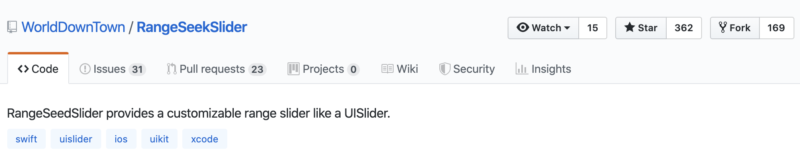
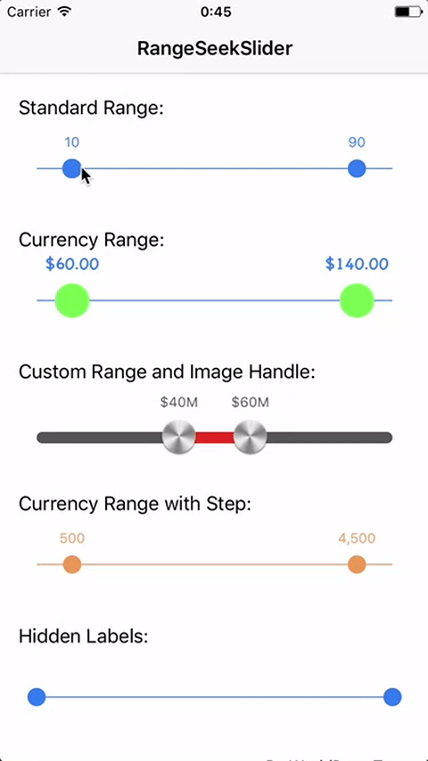
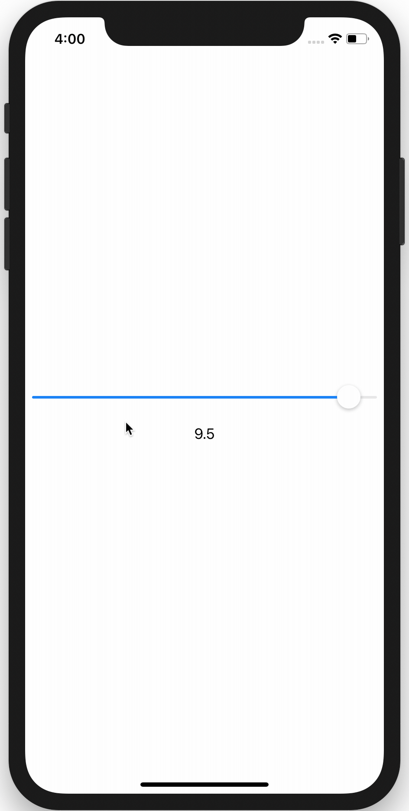
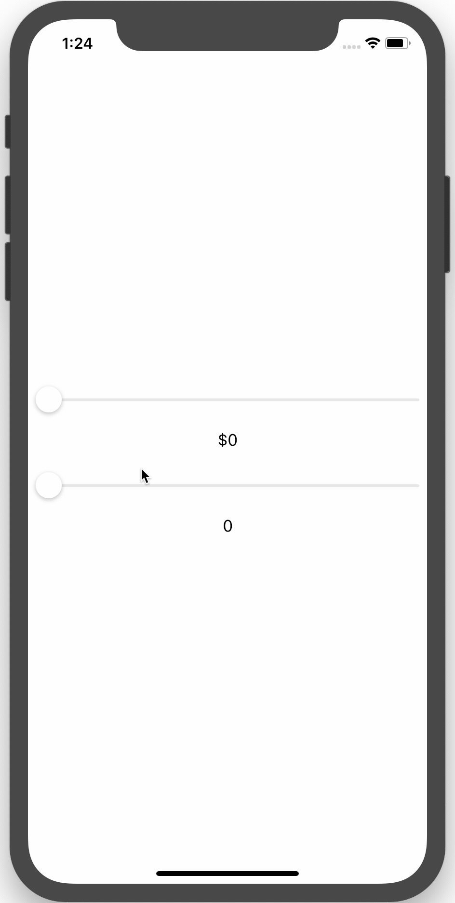
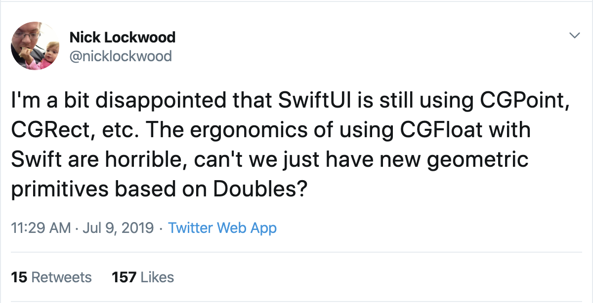
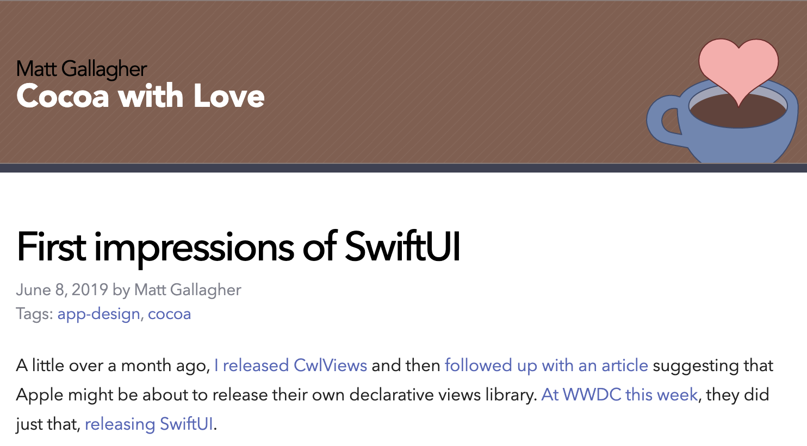
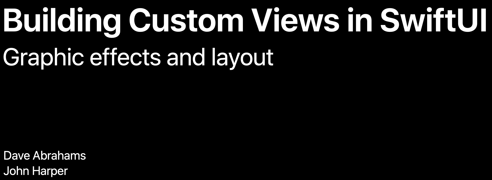
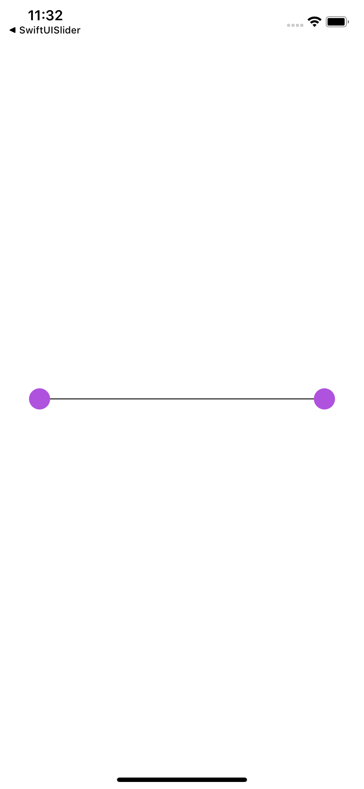
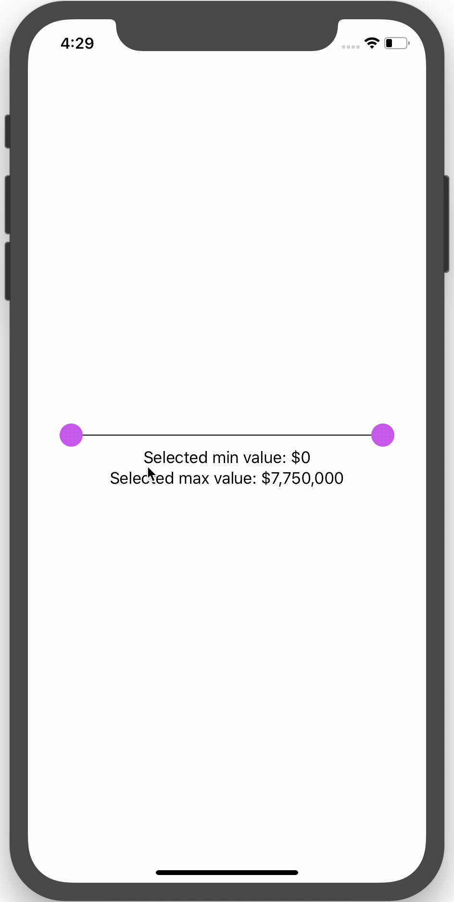

# [fit] From UIKit to SwiftUI

## Veronica Ray
## Senior Software Engineer at Compass

---

# Goal

Rewrite a range slider from UIKit and Core Graphics into SwiftUI

^ when SwiftUI was announced we were all very excited

^ I was curious to see whether it could handle a more complex UI component

^ in order to see the limits of SwiftUI I decided to translate a complex custom component I had made at Compass into SwiftUI

---

# Compass RangeSeekSlider

* Based on an existing open source project
* Heavily modified to remove features we didn't need and to follow our coding style

^ the Compass RangeSeekSlider is only used in real estate agent facing features, so I can't demo it.

^ the open source project has similar UI and supports a lot more cutomizations than we needed in our case

^ I also added some nicer handling for when the handles overlap 

---



---



---

|| Lines of code | 
| --- | :-----------: | :-----------:|
|RangeSeekSlider | 360 | 
|RangeSeekSliderViewModel | 120 | 

---

# [fit] Shapes
# [fit] Gestures

^ this project seemed overwhelming since the Compass RangeSeekSlider took several weeks to get right

^ I decided to simplify the existing code to focus only on the essential ideas I wanted to explore in SwiftUI

---
# [fit] Start Simple 
# [fit] And Get The 
# [fit] Little Details Right

^ I wanted to break down the bigger project into smaller milestones. Even for extremely simple cases, I wanted to make sure the little details were right.


---


^ This is similar to what I've been working with my climbing trainer on

^ At our sessions we don't do climbs that are at my absolute limit. We do climbs that are a few levels below my limit, climbs I could almost always finish my first try. 

^ I have to do these easy climbs while twisting my hips, planning my route ahead of time. Sticking to my plan even if it feels awkward. No pulling. I need to work on jumping down from higher and higher levels. I need to practice falling safely so that if I do accidentalluy slip and fall I won't hurt myself. I have to get all these little details right before my trainer will let me do the climbs that are a challenge for me.

---

# [fit] Native 
# [fit] UISlider

---

# Goals

* Correct padding on left and right side
* Formatted text that displays the selected value 

---



---

# [fit] Dependency Injection 
# [fit] With Views

^ while working on getting this simple example right, I came across the issue of dependency injection with views

---

# This Will Not Compile

```swift
struct TestSlider : View {
    @State var selectedValue: CGFloat = 0.0
    @State var numberFormatter: NumberFormatter
    
    init(numberFormatter: NumberFormatter = NumberFormatter.createNumberFormatter()) {
        self.numberFormatter = numberFormatter
    }
    
    var body: some View {
		// removed for brevity
    }
}
```

^ I wanted to initialize my slider with a numberFormatter we pass in. This is so we could use this slider for a price range or for a square foot range. This is similar to what we're doing in the production RangeSeekSlider.

^ My code didn't compile, so I went Googling around for some answers.

---

> `@State` variables in SwiftUI should not be initialized from data you pass down through the initializer...
-- Joe Groff, Senior Swift Compiler Engineer, [Swift Forums](https://forums.swift.org/t/state-messing-with-initializer-flow/25276) 

^ someone else had ran into the eact same issue and posted in the Swift Forums. Joe Groff responded

---

> ...since the model is maintained outside of the view, there is no guarantee that the value will really be used.
-- Joe Groff, Senior Swift Compiler Engineer, [Swift Forums](https://forums.swift.org/t/state-messing-with-initializer-flow/25276) 

---

# [fit] `@State` Is Primarily 
# [fit] Intended For 
# [fit] Small-Scale UI State

---

```swift
struct TestSlider: View {
    @State private var selectedValue: CGFloat = 0.0
    private let numberFormatter: NumberFormatter
    private let minValue: CGFloat
    private let maxValue: CGFloat
    private let step: CGFloat
    
    init(rangeType: RangeType) {
        self.numberFormatter = rangeType.numberFormatter
        self.minValue = rangeType.minValue
        self.maxValue = rangeType.maxValue
        self.step = rangeType.step
    }
    
    var body: some View {
        VStack {
            Slider(value: $selectedValue, from: minValue, through: maxValue, by: step)
                .padding()
            Text(numberFormatter.string(from: selectedValue as NSNumber) ?? "")
        }
    }
}
```

^ I updated my code to not use State property wrapped for the numberFormatter and everything worked. 

---



---

# [fit] Why Not Use `@BindableObject`?

* numberFormatter, min, max and step aren't going to change once you initialize the slider
* Only one view needs access to these values

---

# [fit] CGFloats?!

^ one interesting thing you might notice in my code example are CGFloats

---

# I thought we were breaking from tradition...

# And leaving behind old baggage that didn't serve us well...

---



^ well you are not the only one to notice this. Nick Lockwood posted on twitter and recieved a lot of responses, including some very helpful ones by none other than Joe Groff

---

# Joe Groff's Response

* CGFloat is still single-precision in arm64_32, which is necessary for any retina display, or a non-retina display bigger than 1024x768.
 
* It's too late for shipping ABIs. 

* "change CGFloat.h so that CGFloat is always double on not-yet-defined platforms" might be a good action to take.

^ I'm not an expert on these topics mentioned, but if you want to learn more I suggest you check out that twitter thread

---

# [fit] Simple
# [fit] Gestures

^ my next step was to make a project with simple gestures. I just wanted to figure out how gestures worked in SwiftUI

---

```swift
    override func beginTracking(_ touch: UITouch, with event: UIEvent?) -> Bool {
    	super.beginTracking(touch, with: event)
		// calculations 
		
        guard isTouchingLeftHandle || isTouchingRightHandle else {
            return false
        }
		// assign handleTracking to .left or .right
		
        return true
    }
```

^ If you subclass a UIControl class you can override these functions to handle touch events. If the user is touching niether of the handles then we fail the gesture. This means that if the user touches the UIcontrol again we will call beginTracking again - it will be treated as a new gesture rather than the continuation of an existing one.

---

```swift
    override func continueTracking(_ touch: UITouch, with event: UIEvent?) -> Bool {
    	super.continueTracking(touch, with: event)
        guard handleTracking != .none else {
            return false
        }

        let location = touch.location(in: self)

		var percentage: CGFloat = 0
        var selectedValue: CGFloat = 0
        percentage = (location.x - sliderLine.frame.minX - handleDiameter / 2) / (sliderLine.frame.maxX - sliderLine.frame.minX)
        selectedValue = max(percentage * (viewModel.maxValue - viewModel.minValue) + viewModel.minValue, viewModel.minValue)

        switch handleTracking {
        case .left:
            viewModel.selectedMinValue = min(selectedValue, viewModel.selectedMaxValue)
        case .right:
            viewModel.selectedMaxValue = max(selectedValue, viewModel.selectedMinValue)
        case .none:
            break
        }

        refresh()

        return true
    }
```

^ if the first touch is valid then in the next touch we will hit this continueTracking function. We have a lot of code here to determine the selected value based on the touch and update the UI of the slider accordingly. 

---

```swift
    override func endTracking(_ touch: UITouch?, with event: UIEvent?) {
    	super.endTracking(touch, with: event)
        handleTracking = .none
        initialTouchPoint = CGPoint.zero
        strokePhase = .notStarted
        trackedTouch = nil
    }
```

^ once the user stops their gesture then we reset the state. Then we slider the handle again we will start in beginTracking.

---

>  SwiftUI doesn't invoke the updating callback when the user ends or cancels a gesture. Instead, the gesture state property automatically resets its state back to its initial value.
-- SwiftUI Documentation

^ Gestures are handled differently in SwiftUI and it's really nice to use

---

>  SwiftUI only invokes the `onEnded(_:)` callback when the gesture succeeds.
-- SwiftUI Documentation

---

```swift
var body: some View {
        let minimumLongPressDuration = 0.5
        let longPressDrag = LongPressGesture(minimumDuration: minimumLongPressDuration)
            .sequenced(before: DragGesture())
            .updating($dragState) { value, state, transaction in
                switch value {
                // Long press begins.
                case .first(true):
                    state = .pressing
                // Long press confirmed, dragging may begin.
                case .second(true, let drag):
                    state = .dragging(translation: drag?.translation ?? .zero)
                // Dragging ended or the long press cancelled.
                default:
                    state = .inactive
                }
            }
            .onEnded { value in
                guard case .second(true, let drag?) = value else { return }
                self.viewState.width += drag.translation.width
                self.viewState.height += drag.translation.height
            }
```

^ this is an example of a sequenced gesture from the SwiftUI documentation. You say that this gesture needs to be a long press and then a drag. You don't have to write any code for the failure cases - say if someone does a drag first.

---


^ after these  milestones I was stuck. The next step, the RangeSeekSlider UI without the gestures, seemed really far away.

^ When I get stuck while learning a new paradigm, I think it's important to take a step back to improve my conceptual understanding. if all I do is play around and try to figure things out on my own I will waste a lot of time going down dead ends and become frustrated. understanding the motivation for a framework and it's underlying implementation details will help me more efficiently figure out the right next step.

---



^ I found this blog post extremely helpful

---

# [fit] Moving From 
# [fit] "How Do I 
# [fit] Do X  In Y?"

---

# [fit] To 
# [fit] "What's The 
# [fit] New X?"

^ I'm going to share some examples to make this more concrete

---

# Where is `UIControl`? 

# Where are `beginTracking`/`continueTracking`/`endTracking`? I have to override them in my new class, right?

---

# [fit] There's no 
# [fit] more 
# [fit] `UIControl`.
# [fit] Use a View.

---


# We now call `updating`, `onChanged` and `onEnd` functions on `Gesture` instead of overriding any functions on our class.

---

# [fit] RangeSeekSlider 
# [fit] Without Gestures

^ after taking time to improve my conceptual understanding, I felt ready to take on the next step.

---



---

* We no longer have a `UIKit` and `Core Graphics` separation
* Everything in SwiftUI is a `View`

---

```swift
struct ContentView : View {
    var body: some View {
        return HStack(spacing: 0) {
            Circle()
                .fill(Color.purple)
                .frame(width: 24, height: 24, alignment: .center)
                .zIndex(1)
            Rectangle()
                .frame(width: CGFloat(300.0), height: CGFloat(1.0), alignment: .center)
                .zIndex(0)
            Circle()
                .fill(Color.purple)
                .frame(width: 24, height: 24, alignment: .center)
                .zIndex(1)
        }
    }
}
```

---



---

# [fit] RangeSeekSlider 
# [fit] With Gestures

^ the final step was to add the gestures

---

```swift
import SwiftUI

struct PriceContentView : View {
    @State private var selectedMinValue: CGFloat = RangeType.price.minValue
    @State private var selectedMaxValue: CGFloat = RangeType.price.maxValue
    @State private var leftHandleViewState = CGSize.zero
    @State private var rightHandleViewState = CGSize.zero
    private let numberFormatter = RangeType.price.numberFormatter
    private let minValue = RangeType.price.minValue
    private let maxValue = RangeType.price.maxValue
    private let step = RangeType.price.step
    private let lineWidth: CGFloat = 300.0
    private let handleDiameter: Length = 24
```

---

```swift
    var body: some View {
        let leftHandleDragGesture = DragGesture(minimumDistance: 1, coordinateSpace: .local)
            .onChanged { value in
                guard value.location.x >= 0, value.location.x <= (self.lineWidth + self.handleDiameter) else {
                    return
                }
                self.leftHandleViewState.width = value.location.x
                let percentage = self.leftHandleViewState.width/(self.lineWidth + self.handleDiameter)
                self.selectedMinValue = max(percentage * (self.maxValue - self.minValue) + self.minValue, self.minValue)
                self.selectedMinValue = CGFloat(roundf(Float(self.selectedMinValue / self.step))) * self.step
        }
```

---

```swift
        let rightHandleDragGesture = DragGesture(minimumDistance: 1, coordinateSpace: .local)
            .onChanged { value in
                guard value.location.x <= 0, value.location.x >= -(self.lineWidth + self.handleDiameter) else {
                    return
                }
                self.rightHandleViewState.width = value.location.x
                let percentage = 1 - abs(self.rightHandleViewState.width)/(self.lineWidth + self.handleDiameter)
                self.selectedMaxValue = max(percentage * (self.maxValue - self.minValue) + self.minValue, self.minValue)
                self.selectedMaxValue = CGFloat(roundf(Float(self.selectedMaxValue / self.step))) * self.step
        }
 ```
 
 ---
 
 ```swift
        return
            VStack(spacing: 0) {
                HStack(spacing: 0) {
                    Circle()
                        .fill(Color.purple)
                        .frame(width: handleDiameter, height: handleDiameter, alignment: .center)
                        .offset(x: leftHandleViewState.width, y: 0)
                        .gesture(leftHandleDragGesture)
                        .zIndex(1)
                    Rectangle()
                        .frame(width: lineWidth, height: CGFloat(1.0), alignment: .center)
                        .zIndex(0)
                    Circle()
                        .fill(Color.purple)
                        .frame(width: handleDiameter, height: handleDiameter, alignment: .center)
                        .offset(x: rightHandleViewState.width, y: 0)
                        .gesture(rightHandleDragGesture)
                        .zIndex(1)
                }
                Text("Selected min value: \(numberFormatter.string(from: selectedMinValue as NSNumber) ?? "")")
                Text("Selected max value: \(numberFormatter.string(from: selectedMaxValue as NSNumber) ?? "")")
        }
    }
}
```

---



---

```swift
    private func xPositionAlongLine(for value: CGFloat) -> CGFloat {
        let percentage = percentageAlongLine(for: value)
        let maxMinDif = sliderLine.frame.maxX - sliderLine.frame.minX
        let offset = percentage * maxMinDif
        return sliderLine.frame.minX + offset
    }
    
    private func percentageAlongLine(for value: CGFloat) -> CGFloat {
        guard viewModel.minValue < viewModel.maxValue else {
            return 0
        }
        let maxMinDif = viewModel.maxValue - viewModel.minValue
        let valueSubtracted = value - viewModel.minValue
        return valueSubtracted / maxMinDif
    }
```

^ this is the previous UIKit code we had to determine the X position of the handle. The SwiftUI version it takes about half as much code.

---

|Lines Of Code| UIKit | SwiftUI | 
| --- | :-----------: | :-----------:|
|Determine which handle was being dragged | 20 | 0 |
|Set the x position of the handle during the drag gesture | 14 | 6 |

---

# Continuously Refine The UI

* Change `minimumDistance` of gestures to 1
* Guard against touch location to make sure handles are always on the line
* Formatted text that displays the selected min and max values

---

# [fit] Your Knowledge 
# [fit] Portfolio

^ now that we've reached the end of my project, I want to cover 2 important themes. The first is your knowledge portfolio. This is a chapter in the classic book The Pragmatic Programmer

---


^ you can thing of your knowledge portfolio like an investment portfolio. learning about new technologies that aren't popular yet carries a higher risk that the knowledge will become irrelevant, but a higher reward that if it takes off then you can get the jobs and be the expert. How many of you all started iOS development when the first iPhone came out? You took a risk on something new and you were greatly rewarded for it.

^ technologies that are more established, like iOS development now, carry a lower risk but also a lower reward since a lot more people have these skills.

^ some brave folks in the iOS community adopted reactive programming and declarative UI programming before this year, even writing their own frameworks and libraries for it. they carried a bigger risk that these technologies wouldn't be widely adopt on iOS, but a bigger reward that they'd be the experts teaching others if Apple did adopt it. 

^ I didn't do reactive programming or know about declarative UI frameworks until I joined Compass 4 months ago. The folks I work with love to learn from other platforms and stay on the cutting edge. It has inspired me to rebalance my knowledge portfolio -- now I have some more risky investments along with the more stable ones.

---

# [fit] SwiftUI Should Be 
# [fit] Open Sourced

^ this topic is covered in more detail in the CocoaWithLove blog psot. At this point Android, web and windows all open source their application frameworks. 

---

> ...the nature of larger declarative systems is such that API documentation will never fill-in all the details... 
-- "First impressions of SwiftUI" by Matt Gallagher

---

> ...there is too much behavior that does not manifest through the interface.
-- "First impressions of SwiftUI" by Matt Gallagher

---

# [fit] www.nerdonica.com
# [fit] @nerdonica

        
        


